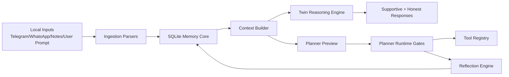

# U

U means "you as software".

Built by agents only, with a human orchestrator named Tanishq.

U is a local-first, agentic system that treats personal cognition as an executable loop: ingest signals, persist memory, reason with twin voices, preview plans under safety gates, and refine behavior through reflection. The direction is unapologetically robotic: deterministic where possible, inspectable everywhere, and designed for autonomous operation on developer machines.

## 1) System Thesis

At time step $t$, the system state is:

$$
S_t = \{M_t, P_t, G_t, R_t\}
$$

Where:

- $M_t$: event memory stream
- $P_t$: profile snapshot
- $G_t$: graph edges over goals, tags, and outcomes
- $R_t$: reflections on execution outcomes

Given user input $x_t$, U computes a twin response pair:

$$
(y_t^{supportive}, y_t^{honest}) = F(x_t, C_t)
$$

with context

$$
C_t = B(M_t, P_t, G_t, R_t)
$$

and a continuous adaptation step (when execution outcomes are available):

$$
S_{t+1} = U(S_t, o_t)
$$

where $o_t$ is planner execution outcome metadata.

## 2) Architecture Overview



### Implemented modules

- Memory: src/u_core/memory/
- Ingest: src/u_core/ingest/
- Twin reasoning: src/u_core/twin/
- Planner/runtime/tools: src/u_core/agent/
- Reflection: src/u_core/reflection/
- UI MVP: src/u_app/gradio_app.py
- Setup and quality scripts: scripts/
- CI + release process: .github/workflows/ and docs/release-checklist.md

## 3) Memory System (Implemented)

U persists structured memory in SQLite with baseline migration tracking.

Core tables:

- schema_migrations
- events
- reflections
- profiles
- graph_edges

Memory stores in code:

- SQLiteStore: CRUD for events and reflections, schema initialization, WAL mode, FK enabled
- ProfileStore: upsert versioned JSON profiles
- GraphStore: upsert/list relation edges with weights and metadata
- InMemoryVectorStore: in-process cosine retrieval fallback for lightweight semantic experiments

Graph edge representation:

$$
e = (source, relation, target, weight, metadata, updated\_at)
$$

Vector similarity used in fallback vector store:

$$
\cos(\theta) = \frac{a \cdot b}{\|a\|\|b\|}
$$

## 4) Twin Reasoning (Implemented)

Twin reasoning generates two coordinated voices from the same memory-grounded context:

- supportive response
- honest response

Context assembly (build_twin_context):

- recent events
- recent reflections
- profile snapshot
- graph edges
- derived tags and outcomes

Inference clients:

- LocalHeuristicClient (deterministic in-process fallback)
- OllamaClient (local CLI-backed runtime via ollama run)

Runtime profiles:

- 8gb preset: llama3.2:3b
- 16gb preset: llama3.1:8b

If Ollama inference fails, TwinReasoningEngine falls back to LocalHeuristicClient.

## 5) Planner Runtime and Tools (Implemented Core)

PlannerRuntime enforces staged execution safety through envelopes:

- preview
- approve
- execute
- verify

Execution is permitted only when trust_level is execute-approved and approval is true.

Tool action protocol:

- textual action format: tool:name:{json_payload}
- payload validated as JSON object
- irreversible_write tools require CONFIRM token in approval reason

Default local-safe macOS tool registry currently includes:

- file_search (read_only): bounded local text search
- app_open_preview (reversible_write): preview-only app-open action, no real launch
- calendar_draft_event (reversible_write): deterministic draft payload only

## 6) Reflection and Self-Improvement Loop (Implemented)

After planner execution (or denied execution), reflection writes:

- reflection record (kind=planner_execution)
- profile updates (version increments)
- graph edge updates derived from outcomes/tags

Conceptually:

$$
\Delta P, \Delta G, \Delta R = \Phi(o_t)
$$

and then:

$$
S_{t+1} = S_t + \{\Delta P, \Delta G, \Delta R\}
$$

This is how U improves over time: accumulated outcomes and tags influence later grounding hints, planner suggestions, and response framing.

## 7) Data Ingestion and Local Storage Lifecycle (Implemented)

U ingests text through source-specific parsers and stores normalized records as deterministic events.

### Sources and parser behavior

- WhatsApp plaintext export parser:
	- extracts timestamp, sender, message
	- supports multiline message continuation
	- extracts hashtags into normalized lowercase tags

- Telegram plaintext export parser:
	- supports bracketed timestamp formats present in exports
	- extracts sender/message
	- supports multiline message continuation
	- extracts hashtags

- Local notes parser:
	- parses note-style text into normalized records

### Normalization to event writes

Each NormalizedRecord is persisted through ingest service with:

- event_type (default ingest.record)
- content (record content)
- metadata merged as:
	- source
	- source_id
	- tags
	- parser-provided metadata fields

No remote database is used in this pipeline. Storage is local SQLite on disk.

### Local filesystem paths

Primary data root:

- ~/Library/Application Support/U

Fallback data root (if primary path creation fails):

- ~/U/data

Default DB location:

- {data_root}/db/memory.sqlite3

## 8) UI Surface (Implemented MVP)

The Gradio UI provides:

- user text input
- supportive output panel
- honest output panel
- planner preview goal
- planner preview proposed actions

UI execution path:

1. open SQLite store and initialize schema
2. build twin context from memory
3. generate dual responses
4. generate planner preview text
5. render all four outputs

## 9) Setup, Quality, CI, and Release Flow

### Local setup

Run:

```bash
python scripts/setup_u.py
```

What setup does:

- creates local data dirs (primary or fallback)
- initializes SQLite schema
- checks for local ollama binary presence
- blocks network calls during setup validation

### Run UI

Run:

```bash
pip install gradio
python scripts/run_ui.py
```

Optional DB path override:

```bash
python scripts/run_ui.py --db-path /path/to/memory.sqlite3
```

### Quality gate

Run:

```bash
python scripts/check_quality.py
```

This executes:

1. compile sanity: python -m compileall src tests scripts
2. tests: python -m pytest tests

### CI quality

GitHub Actions workflow runs compile + pytest across:

- OS: ubuntu-latest, macos-latest
- Python: 3.11, 3.12

### Release flow (v0.1.0 process)

1. create release/v0.1.0 from develop
2. run local + CI quality gates
3. finalize changelog/release notes
4. merge release to main and tag v0.1.0
5. back-merge main into develop

## 10) Current Status and Remaining Work

### Current status (implemented now)

- Local-first memory core with SQLite schema and stores
- Ingestion parsers for WhatsApp/Telegram/notes text exports
- Twin dual-response engine with local heuristic and Ollama runtime options
- Planner envelope gating and deterministic local-safe tool registry
- Reflection engine writing execution reflections and memory updates
- Gradio MVP for dual outputs + planner preview
- Local quality script plus CI matrix and release checklist

### Roadmap (not yet fully implemented)

- Rich execution of planner actions beyond preview-oriented local tool adapters
- Broader ingestion connectors and richer structured extraction
- More advanced vector indexing backends beyond in-memory fallback
- Stronger automated reflection policies and long-horizon adaptation metrics
- Expanded UI/UX beyond MVP and deeper runtime observability

## 11) Research-Style Agentic Direction

U is designed as a machine for personal agency compounding: each cycle hardens local memory, improves grounding quality, and increases action precision while preserving human governance through explicit approval gates.

The target future is agentic and concrete:

- autonomous where risk is bounded
- inspectable where decisions matter
- local by default for data control
- continuously improving through reflected outcomes
